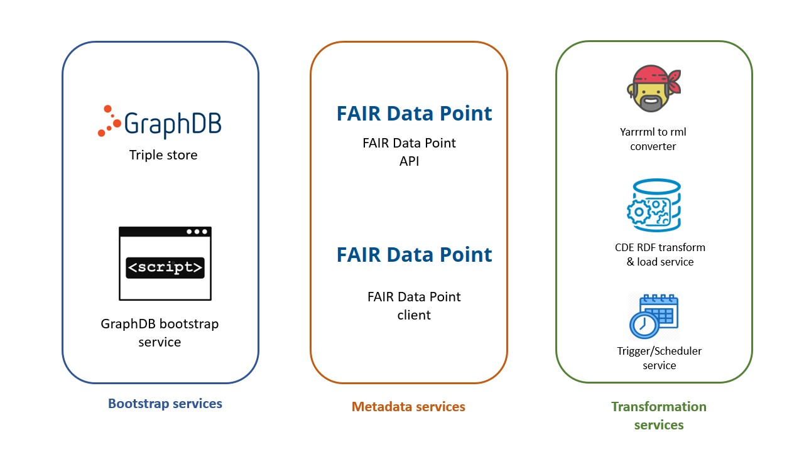

# FAIR-in-a-box

FAIR in a box is an offshoot of the original [CDE-in-a-box](https://github.com/ejp-rd-vp/cde-in-box) created by [Rajaram Kaliyaperumal](https://github.com/rajaram5). It differs primarily in the installation process (now fully automated) and adds the ability to do YARRRML-based transformations from CSV into RDF.

## CONTENTS

- [Installation requirements](#requirements)
- [Downloading](#downloading)
- [Installing](#installing)
- [Testing your installation](#testing)
<<<<<<< HEAD
=======
- [Fixing the "can't edit via the web page" problem](#repair_installation)
>>>>>>> f6975f81386c344c7793033ba100bc3fbb47eba7
- [Using your FAIR-in-a-Box](#using)
- [Customizing your FAIR-in-a-Box](#customizing)

<a name="requirements"></a>

## Requirements

In order to use the FAIR-in-a-box solution you `have to` meet following requirements.

**User requirements (Person who is deploying this solution)**

- Basic knowledge about Docker​
- Basic GitHub knowledge​
- (optional) Awareness of the EJP RD's CDE semantic model if you plan to create FAIR data

**System requirements​ (Machine where this solution is being deployed)**

- Docker engine ​
- Docker-compose application​

---

<a name="downloading"></a>

## Downloading

#### FAIR-in-a-box

To get the FAIR in a box code clone this repository to your machine.

```sh
git clone https://github.com/markwilkinson/FAIR-in-a-box
```

#### GraphDB

To use FAIR-in-a-box you also need to download the _standalone_ graphDB triple store free edition. Follow the steps below to get free edition of graphdb.

**Step 1:** GO to this [url](https://www.ontotext.com/products/graphdb/graphdb-free/) and register to download GraphDB free edition.

**Step 2:** The download link will be sent to your email. From the email follow link to download page and `click` on _"GraphDB platform independent"_. This step will download "graphdb-{version}-dist.zip" file to your machine.

**Step 3:** Move "graphdb-{version}-dist.zip" file to the following location

```sh
mv graphdb-{version}-dist.zip FAIR-in-a-box/bootstrap/graph-db
```

**Step 4:** If your `graphdb version` is different from `10.1.0` then change the version number of graph DB in the ./FAIR-in-a-box/bootstrap/docker-compose file.

```sh
graph_db:
    build:
      context: ./graph-db
      dockerfile: Dockerfile
      args:
        version: 10.1.0    <-----------
```

**Step 5:** If your `graphdb version` is different from `10.1.0` then change the version number of graph DB in the ./FAIR-in-a-box/bootstrap/graph-db/Docker file

```sh
FROM adoptopenjdk/openjdk11:alpine

# Build time arguments
<<<<<<< HEAD
ARG version=10.1.0   <-----------
=======
ARG version=9.9.1   <-----------
>>>>>>> f6975f81386c344c7793033ba100bc3fbb47eba7

```

---

<a name="installing"></a>

## Installing

### Initial Test (default installation to localhost)

Once you have done above downloads and configurations you can run "run-me-to-install.sh" in the ./FAIR-in-a-box/ folder

```sh
./run-me-to-install.sh
```

After several minutes, the installer will send a message to the screen asking you to check that the installation was successful. This message will last for 10 minutes, giving you enough time to explore the links below. After 10 minutes, the services will all automatically shut down. You can stop the installer by CTRL-C anytime.

If installation is successful on localhost, then you should move on to a "production" installation.


### Production Installation (using your domain or purl)

#### Without SSL Certificate

You need to edit two files:

```
./metadata/fdp/application.yml
./FAIR-ready-to-go/fdp/application.yml

```

The lines you need to edit in both files are:

```
    clientUrl: http://localhost:7070
    persistentUrl: http://localhost:7070

```

Replace the localhost URL with your own URL (note that you should NOT include a trailing slash!). These will form the base of all auto-generated URLs from the FAIR Data Point.

Once you have done the edits re-run "run-me-to-install.sh" in the ./FAIR-in-a-box/ folder

```sh
./run-me-to-install.sh
```

This will now set-up your FAIR Data Point with production URLs.

Once that installation is complete. CTRL-C to shut it down.

The folder `FAIR-ready-to-go` contains your production FAIR Data Point. To run it:

```
cd FAIR-ready-to-go
docker-compose up -d
```

Give it a few minutes to startup, then browse to your root URL (the one you set as persistentUrl in the application.yml file). Voila!

#### With SSL Certificate and HTTPS Proxy

1.  Make sure you have updated the URLs in `./metadata/fdp/applicaton.yml` to match what the new address/port will be. If you do not change the defaults, it will be https://your-domain:8443. If you edit `FAIR-ready-to-go/proxy.conf` then you have to synchronize those changes before running the installer!
2.  Run the installation steps above (the steps without an SSL certificate)
3.  Uncomment the "hitch" service in the docker-compose file.  **NOTE: Hitch and Varnish are often used together... I found that Varnish has a frustrating habit of caching... I no longer recommend that you use it for this application.   MDW**
4.  If you need to, you can edit the "frontend" line in the `FAIR-ready-to-go/proxy.conf` file. If you leave it as-is, your FDP will run on https port 8443, which will generally be OK
5.  Edit the `FAIR-ready-to-go/docker-compose.yml` "hitch" service configuration so that `./combined.pem:/etc/hitch/cert.pem` is mapping YOUR certificate+key .pem file to the /etc/hitch/cert.pem inside the docker image (do not edit this filename!!)
6.  If you wish, you can remove the exposed non-SSL port from the fdp_client service in the docker-compose file, as it is no longer needed
7. *NOTE* There are situations where Hitch will cache an old copy of your certificate, casing "expired certificate" errors in people's browsers.  To fix this, docker-compose down and docker-compose up again.

Additional customization options are described below.

---

<a name="repair_installation"></a>

## Repair the "unable to edit" problem

For unknown reasons, the `run-me-to-install.sh` script results in an FDP that has a duplicate created and modified date.  This is invalid, according to the SHACL, and renders the FDP uneditable (even if you remove that data via the web interface!).  

The easiest way to fix it is to modify the SHACL (temporarily) to allow you to create/edit the record.  This process is described in [this slide deck](https://docs.google.com/presentation/d/1lR96U7nShJqx2wIytWKrNbmWLzr5EBEUE6OpuycZYqg/edit).  This works for me... your milage may vary!


---
<a name="testing"></a>

## Testing your installation

- If the **GraphDB** deployment is successful then you can access GraphDB by visiting the following URL.

**Note:** If you deploy the `FAIR in a box` solution in your laptop then check only for **local deployment** url.

| Service name | Local deployment                                | Production deployment |
| ------------ | ----------------------------------------------- | --------------------- |
| GraphDB      | [http://localhost:7200](http://localhost:7200/) | http://SERVER-IP:7200 |

By default GraphDB service is secured so you need credentials to login to the graphDB. Please find the default graphDB's credentials in the table below.

| Username | Password |
| -------- | -------- |
| `admin`  | `root`   |

- If the **FAIR Data Point** deployment is successful then you can access the FAIR Data Point by visiting the following URL.

| Service name    | Local deployment                               | Production deployment |
| --------------- | ---------------------------------------------- | --------------------- |
| FAIR Data Point | [http://localhost:7070](http://localhost:7070) | http://SERVER-IP:7070 |

**Note:** If you deploy the `FAIR in a box` solution in your laptop then check only for **local deployment** url.

In order to add content to the FAIR Data Point you need credentials with write access. Please find the default FAIR Data Point's credentials in the table below.

| Username                      | Password   |
| ----------------------------- | ---------- |
| `albert.einstein@example.com` | `password` |

---

<a name="using"></a>

# Using FAIR-in-a-box for data transformation

NOTE: The folders "metadata" and "bootstrap" are no longer needed unless you plan to customize your installation (e.g. change the colors or logos - see "Customization" below). You may delete them if you wish, or move them to some backup folder to keep for later. ALL ACTIVITIES FROM NOW ON HAPPEN INSIDE OF THE FAIR-ready-to-go FOLDER.

In the folder ./FAIR-ready-to-go there is a docker-compose.yml file, and two direc
tories. You may move these files/folders anywhere on your system, once you have completed the installation and testing described above

the folder structure is:

```
.--
  | docker-compose.yml
  | /data
  ---
    | /triples
  | /config

```

- The /data folder contains CSV, with each CSV file representing one data element that should be transformed.
- The /config folder contains [YARRRML Templates](https://github.com/ejp-rd-vp/CDE-semantic-model-implementations/tree/master/YARRRML_Transform_Templates), one for each of the CSVs. You may add new YARRRML templates into this folder, and the associated CSV into the /data folder, so long as they follow the naming conventions that allow them to be automatically matched.

#### Preparing input data

The transformation services take `CSV` as input files. We provide `CSVs` with example data and `YARRRML` templates for each of the European Rare Disease CDEs [here](https://github.com/ejp-rd-vp/CDE-semantic-model-implementations/tree/master/YARRRML_Transform_Templates).
The `YARRRML` templates are always loaded from GitHub automatically, so they stay up-to-date as we change the models in EJP-RD, but the `CSV` files must be added by the user.

#### Configuring configuration and data folders

**Step 1:** Folder structure

Make sure the following folder structure, relative to where you plan to keep your pre and post-transformed data, is available:

```
        .
        .FAIR-ready-to-go/data/
        .FAIR-ready-to-go/data/mydataX.csv  (input csv files, e.g. "height.csv")
        .FAIR-ready-to-go/data/mydataY.csv...
        .FAIR-ready-to-go/data/triples   (this is where the output data will be written, and loaded from here into Graphdb)
        .FAIR-ready-to-go/config/   (this is the folder where yarrrml templates will be automatically loaded from the EJP repository)
```

**Step 2:** Edit the .env file

the .env file will create the values for the environment variables in the docker compose file. The first of these `baseURI` is the base for all URLs that represent your transformed data. This should be set to something like:

`http://my.database.org/my_rd_data/`

this will result in Triple that look like this:

`<http://my.database.org/my_rd_data/person_123345_asdssaewe#ID> <sio:has-value> <"123345">`

optimally, these URLs will resolve...

**Step 3:** Running data transformation services

To start the data transformation services, execute the `docker-compose.yml` file that can be found in the fair-ready-to-go folder. If you want to run the transformation services in some other location on your server, just remember **THE docker-compose MUST BE RUN IN THE SAME FOLDER THAT CONTAINS THE .env, THE ./data/triples, and ./config subfolders**

```
docker-compose pull
```

followed by:

```sh
docker-compose up -d
```

**Step 4:** Input CSV files

Put an appropriately columned `XXXX.csv` into the `FAIR-in-a-box/FAIR-ready-to-go/data`. Please look into [this](https://github.com/ejp-rd-vp/CDE-semantic-model-implementations/tree/master/YARRRML_Transform_Templates) github repository for examples of CDEs `CSV` files.

**Step 5:** Input YARRRML templates

The `YARRRML` templates are always loaded from GitHub automatically on step 5, so they stay up-to-date as we change the models in EJP-RD.

Make sure the `YARRRML` templates files are matching your `CSV` files names `XXXX_yarrrml_template.yaml` and are in the `FAIR-in-box/FAIR-ready-to-go/config` folder. Please look into [this](https://github.com/ejp-rd-vp/CDE-semantic-model-implementations/tree/master/YARRRML_Transform_Templates) github repository for CDEs `YARRRML` templates.

**Step 6:** Executing transformations

Call the url: http://localhost:4567 or http://SERVER-IP:4567 to trigger the transformation of each CSV file, and auto-load into graphDB (this will over-write what is currrently loaded! We will make this behaviour more flexible later)
**Note:** If you deploy `FAIR in a box` solution in your laptop then check only for **localhost** url.

**There is sample data (height.csv) in the "FAIR-ready-to-go/data" folder that can be used to test your installation.**

### How to modify semantic model in data transformation service

YARRRML is one the core technology which has been used in our data transformation service. If you like to extend the exemplar CDE semantic models or add other semantic model to describe your data then, you have to provide custom YARRRML templates to the data transformation service. To learn more about building custom YARRRML templates please try [matey webapp](https://rml.io/yarrrml/matey/).

<a name="Understanding"></a>

# Understanding your FAIR in a box installation

## Software used in FAIR in a box

The image below gives an overview of software used in the `FAIR in a box` solutions.

<p align="center"> 
    <a href="docs/images/components_overview.jpg" target="_blank">
         
    </a>
</p>

**Triple store:**
To store the `rdf` documents generated by the `FAIR in a box` solution we need to have a triplestore which stores these document. In the `FAIR in a box` solution we use graphDB as a triplestore. To know more about the graphDB triplestore please visit this [link](https://graphdb.ontotext.com)

**FAIR Data Point:**
To describe the content of your resource we need a `metadata provider` component. For the `FAIR in a box` solution we use `FAIR Data Point` software that provides description (metadata) of you resource. To learn more about the FAIR Data Point please visit this [link](https://fairdatapoint.readthedocs.io/en/latest/)

<a name="Alternatives"></a>

# Alternatives

## Related solutions

In this section we list other related solutions.

**MOLGENIS CDE in a box**  
MOLGENIS EDC provider also provides a complete set of `CDE in a box` with EDC system. To learn more about MOLGENIS implementation of the `CDE in a box` solution please visit this [link](https://github.com/fdlk/cde-in-box/tree/feat/molgenis)

<a name="customizing"></a>

# Customization of your installation

## Update username and password for the FDP

- Go to http://localhost:7200 and login with the default username and password ("admin"/"root").
- Enter the "settings" for the admin account, and update the password. Note that this account will have access to both the metadata and the data (!!) so make the password strong!
- at the terminal, shut down the system (docker-compose down)
- go to the ./metadata/fdp folder and edit the file "application.yml"
- in the repository settings, update the username and password to whatever you selected above
- now you need to edit the configuration file in the FDP docker image. To do this, shut-down your FAIR-ready-to-go (`docker-compose down`) then edit the `./metadata/fdp/application.yml` file to update the graphdb authentication username/password.

- now go back to the FAIR-ready-to-go folder and bring the system back up. Your FDP database is now protected with the new password.

## Create a "safe" user for the CDE database

- Go to http://localhost:7200 and login with the current username and password
- Enter the "settings" and "users".
- Create a new user and password, giving them read/write permission ONLY on the CDE database, and read-only permission on the FDP database.
- in the FAIR-ready-to-go folder, update the `.env` file with this new limited-permissions user
- docker-compose down and up to restart the server

## Update the colors and logo

- go to the `FAIR-ready-to-go/fdp` folder
- add your preferred logo file into the ./assets subfolder
- edit the ./variables.scss to point to that new logo file, and select its display size (or keep the default)
- to change the default colors, edit the first two lines to select the primary and secondary colors (the horizontal bar on the default http://localhost:7070 homepage shows the primary color on the left and the secondary color on the right)
- if you have a preferred favicon, replace the one in that folder with your preferred one.
- now go back to the FAIR-ready-to-go folder and bring the docker-compose back up. Your FDP client will now be customized with your preferred icons and colors
